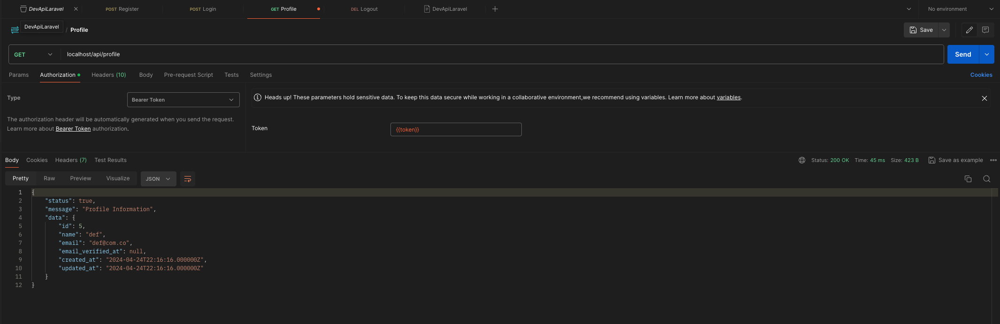
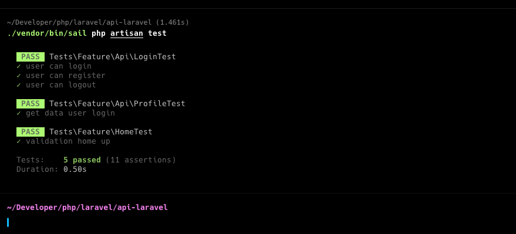

<p align="center">
    <a href="https://favillon.site" target="_blank">
        
    </a>
</p>


## Creacion de los Modelos Factories Migraciones y Seed

Comando creacion Modelos Migraciones y Factories

```
./vendor/bin/sail php artisan make:model AccountType -mf 
./vendor/bin/sail php artisan make:model TransactionType -mf 
./vendor/bin/sail php artisan make:model Account -mf 
./vendor/bin/sail php artisan make:model Transaction -mf 
```

Corriendo las migracion y los factories

```shell
./vendor/bin/sail php artisan migrate --seed
```


# Proyecto base para creacion de API con Laravel
***

Proyecto base para creacion de API con Laravel (imagenes, accestoken, test)
- Tener instalador con Docker.
- Tener docker-compose

Este proyecto tiene  `psql` y `redis` como base

Para levantar el entorno solo debe hacer pull al repositorio y posterior  acceder y levantar sail 

```shell
git clone git@github.com:favillon/api_laravel.git
cd api-laravel/ && ./vendor/bin/sail up
```

## Acceso a la aplicacion 

Url de acceso principal
```
localhost
```

## URL 
Url de navegacion basica

```
POST localhost/api/register
POST localhost/api/login
GET localhost/api/profile
DELETE localhost/api/logout
```

Existe una coleccion en postman para si vinculacion y testeo 
> ./readme/DevApiLaravel.postman_collection.json



## Ejecucion de pruebas

Para ejecutar las pruebas 
```shell
./vendor/bin/sail php artisan  test
```
Resultado



### Creacion del proyecto

Se crea usando sails y las configuraciones basicas BD, y manejo de cache

```shell
curl -s "https://laravel.build/technical-test-fabian-villon?with=pgsql,redis" | bash
```